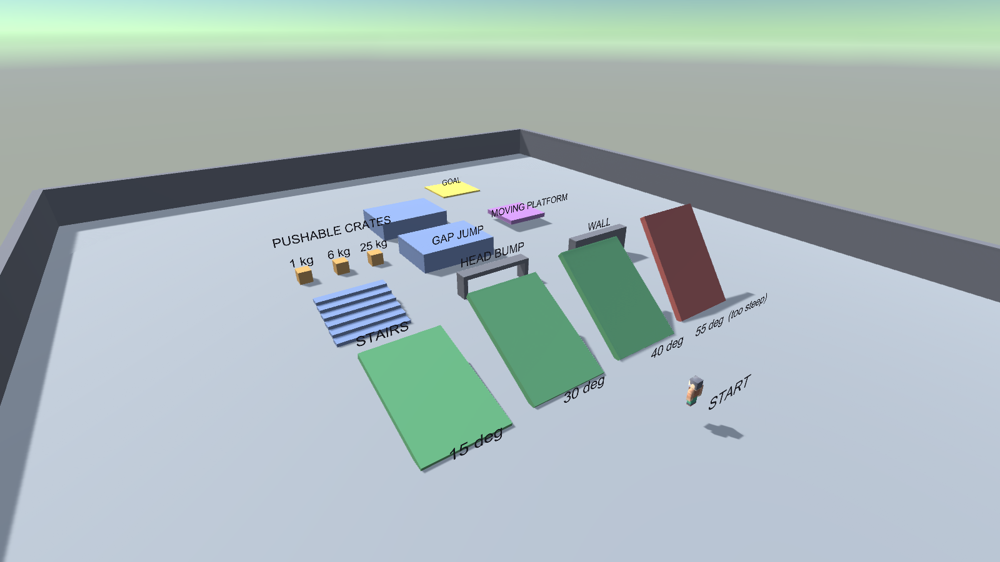
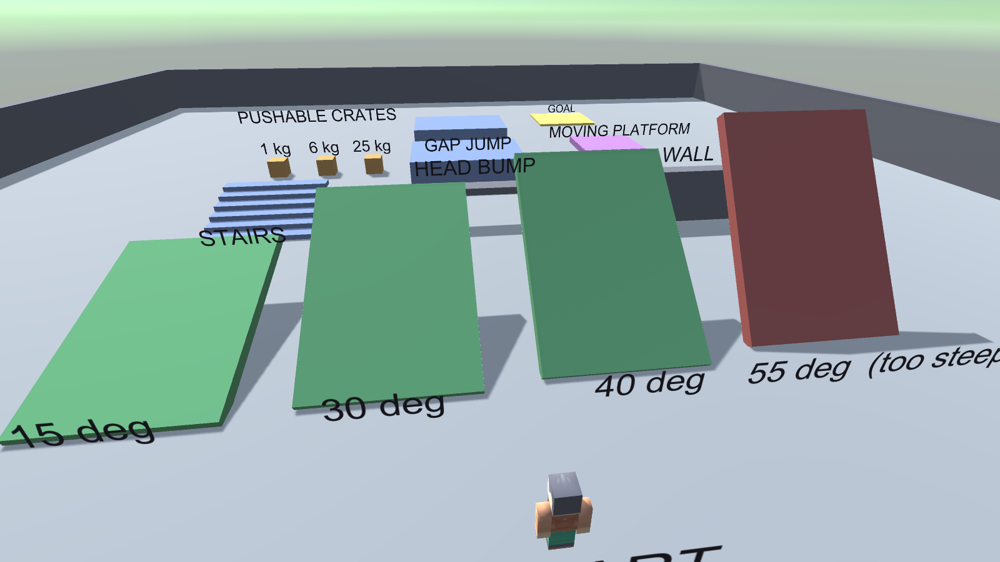
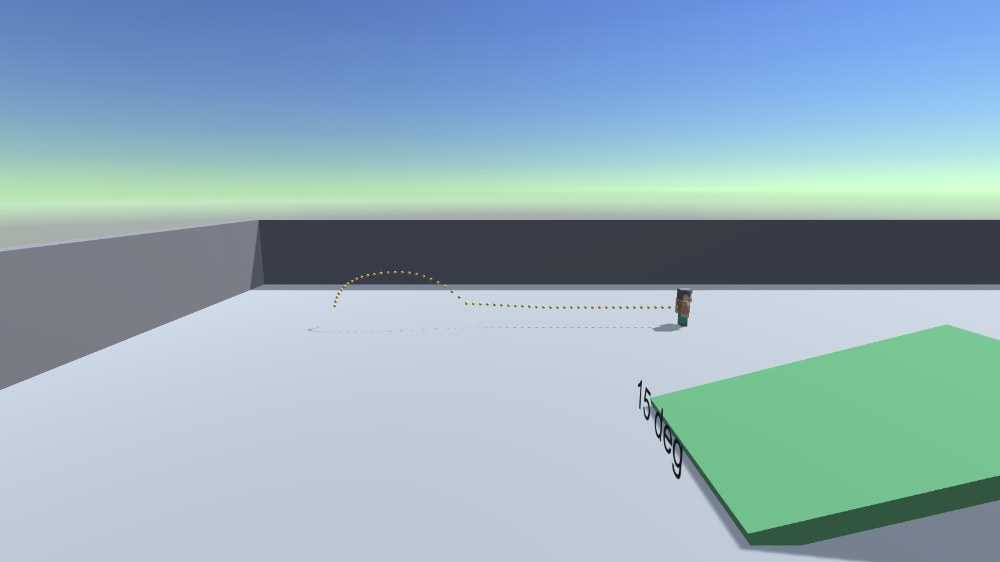
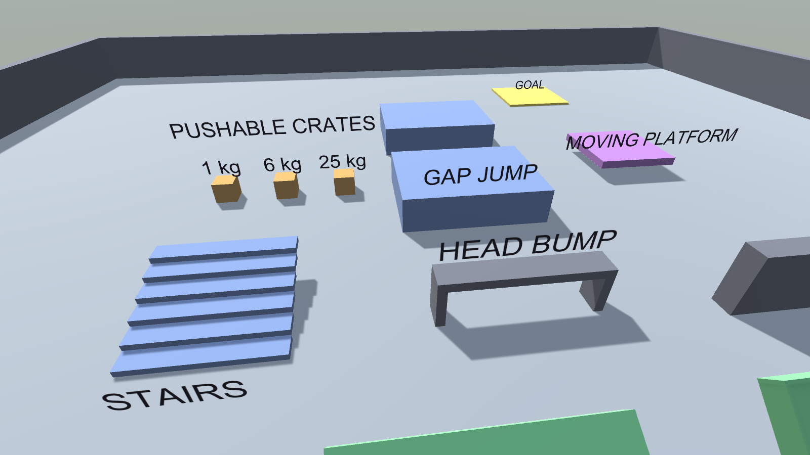

# Player Controller and Basic Physics, Unity Week 2

**Unity 6000.4.7f1 · Built-In Render Pipeline · Windows**

A playable third person character driven by a dynamic Rigidbody, and a purpose built obstacle
course that isolates one physics behaviour per obstacle. Every movement rule in the controller is
covered by an automated test that measures the simulation rather than eyeballing it.



---

## 1. Running it

1. Unity Hub, **Add**, select the `Week2_PlayerController` folder, open with **6000.4.7f1**.
2. Open `Assets/_Project/Scenes/PlayerCourse.unity`.
3. Press **Play**.

A project created from the command line does not appear in Unity Hub until you add it, and Unity
opens a blank `Untitled` scene the first time, so step 2 matters.

| Control | Action |
|---|---|
| W A S D or arrows | Move, relative to the camera |
| Space | Jump. Hold for a higher jump, release early to cut it short |
| Shift | Sprint |
| Mouse | Orbit the camera |
| F1 | Toggle the on screen readout |

The readout shows live speed, vertical velocity, grounded state and the angle of the ground
underfoot, so the physics is inspectable while playing.

---

## 2. Script design

Five runtime scripts and three editor scripts. Every runtime script is a single responsibility
and none of them know about the editor.

```
Assets/_Project/Scripts/
├─ Runtime/
│  ├─ PlayerController.cs     movement, ground detection, jumping, slopes
│  ├─ InputSources.cs         MoveInput, IInputSource, keyboard and scripted sources
│  ├─ CharacterAnimator.cs    procedural walk cycle driven by velocity
│  ├─ FollowCamera.cs         damped third person orbit camera
│  ├─ MovingPlatform.cs       kinematic platform that carries its rider
│  └─ ControlsHud.cs          OnGUI overlay, controls plus live physics readout
└─ Editor/
   ├─ CourseBuilder.cs        builds the whole scene deterministically
   ├─ PhysicsTests.cs         headless behavioural test suite
   └─ Screenshots.cs          renders the figures in this document
```

### The two decisions that shaped everything else

**A dynamic Rigidbody, not Unity's CharacterController component.** `CharacterController` is the
faster route to a walking character, but it deliberately bypasses the physics engine: it cannot
push a rigidbody, cannot be pushed by one, and resolves its own collisions outside the solver.
The brief asks for a physics simulation with gravity and collision interactions, so the player is
a real `Rigidbody` with a `CapsuleCollider` and takes part in the same simulation as the crates.
The cost is that every behaviour a `CharacterController` gives away free, ground detection, slope
limits, step handling, has to be written. Sections 3 and 4 are that work.

**Movement lives in a public `Tick(MoveInput, float dt)`, not directly in `FixedUpdate`.**
This looks like an odd indirection until you try to test it. `Physics.Simulate()` steps the
solver but **does not call `FixedUpdate`**, so a test cannot drive the controller through Unity's
normal loop at all. Exposing `Tick` lets the test call it and then step physics by hand:

```csharp
for (int i = 0; i < steps; i++)
{
    player.Tick(input.Read(), DT);
    Physics.Simulate(DT);
}
```

`FixedUpdate` is then a one line caller. The same seam is why `IInputSource` exists: the tests
substitute a `ScriptedInputSource` so the controller can be driven with no keyboard present.

### Input edges versus physics steps

`Input.GetButtonDown` is true for exactly one render frame. The controller runs in `FixedUpdate`,
which may not run on that frame, or may run twice. Reading the jump edge directly in `FixedUpdate`
therefore drops jumps on high frame rates and double fires them on low ones.

`KeyboardInputSource` solves this by splitting the read: `Poll()` runs in `Update` and latches the
edge, `Read()` runs in `FixedUpdate` and consumes it. That is the only reason `IInputSource` has
two methods.

---

## 3. Physics settings, and why

### On the player

| Setting | Value | Reason |
|---|---|---|
| Rigidbody mass | 70 kg | Realistic, and it sets how hard the crates are to shove |
| Freeze rotation | on | The controller aims the model; physics torque would tip the capsule over |
| Interpolation | Interpolate | Physics runs at 50 Hz, rendering does not. Without this the player visibly stutters even though the motion is correct |
| Collision detection | ContinuousDynamic | At the measured terminal fall speed of 43.8 m/s the player moves 0.88 m per step against a 1 m thick floor. Discrete detection tunnels |
| Capsule | height 1.8, radius 0.38 | A 1.8 m person |
| Physics material | friction 0.02, Minimum combine | The controller writes velocity directly, so collider friction only fights it and makes the player cling to walls it brushes |

### In the controller

| Setting | Value | Reason |
|---|---|---|
| Walk / sprint | 5.0 / 8.5 m/s | Brisk jog and a run |
| Ground accel / decel | 55 / 65 m/s squared | Reaches full speed in about 0.1 s. Lower felt sluggish, higher removed any sense of weight |
| Air acceleration | 16 m/s squared | Roughly a third of ground control, so a jump commits you without feeling locked |
| Jump height | 1.7 m | Set in **metres**, not as an impulse. The code solves `v = sqrt(2gh)`, so the number means something and the test can assert against it |
| Coyote time | 0.12 s | Jump still fires just after walking off a ledge |
| Jump buffer | 0.12 s | Jump pressed just before landing is not swallowed |
| Fall gravity multiplier | 2.2 | Real gravity alone gives a floaty, slow descent |
| Low jump multiplier | 2.6 | Releasing jump early cuts the rise, giving variable height |
| Slope limit | 45 degrees | Below it you walk, above it you slide |
| Ground stick | 12 | Pushes into the ground so walking downhill does not launch you into the air every bump |

Gravity is left at Unity's default `-9.81`. The fall and low jump multipliers add extra
acceleration on top of it rather than changing the global, so falling crates still behave normally.

### Ground detection

A `SphereCast` straight down from the bottom of the capsule, not collision callbacks. Contact
normals are noisy at edges and give a grounded flag that flickers when standing on a corner.
The cast uses `SphereCastNonAlloc` rather than `SphereCast` because the cast begins inside the
player's own capsule, so the nearest hit is frequently the player, and a single result cast simply
returns that. The loop skips any hit belonging to the player and keeps the closest of the rest.

Ground angle decides everything downstream: at or under 45 degrees it is walkable, above it the
player is treated as airborne and gets an acceleration down the slope so they slide off.



---

## 4. Challenges

### The jump only moved the player 11 cm

The first test run reported a peak jump height of **0.112 m** against a 1.7 m target. That number
is exactly one physics step of the correct jump velocity, `5.77 m/s x 0.02 s`, which said the
velocity was being set correctly and then destroyed on the very next step.

The cause was ordering. After jumping, the player is only 11 cm off the floor, well inside the
0.30 m ground check, so the next step re-grounded them. The grounded branch re-projects velocity
onto the ground plane to keep speed constant on slopes:

```csharp
v = alongSlope - GroundNormal * (groundStick * dt);
```

`alongSlope` is horizontal, so this assignment discarded the upward velocity entirely. Two fixes:
the branch now only runs when `v.y <= 0`, and a 0.12 s lockout stops the ground check re-grounding
immediately after a jump. Coyote time had been failing for the same reason and started passing
once this was fixed.

### A test that was wrong, not the code

The 30 degree slope test failed reporting a height gain of **-0.400 m**, which looks like the
player could not climb. It could. The test ran 220 steps at 5 m/s, which is 22 m of travel, and
the ramp is only 9 m long: the player climbed it, walked off the top and landed back on flat
ground, and the test measured the **final** height. Tracking the peak instead reports 4.411 m,
matching the ramp's real 4.5 m rise.

Worth recording because the failure looked exactly like a controller bug. The measured numbers in
the test output are what made the difference; a bare pass or fail would have sent me into the
controller.

### Verifying something interactive

Week 1 was a static scene, so rendering an image and looking at it was proof. Nothing about a
still image proves that jumping works. The whole testing approach in this project exists because
of that, and it caught both bugs above before the scene was ever played by hand.

### The character had a rig but no animations

The Kenney pack is rigged as six separate parts with pivots at the joints, but ships no clips.
Instead of sourcing animations, `CharacterAnimator` rotates the limbs directly, advancing the
stride by **distance travelled** rather than by time, so the feet keep pace with the body at any
speed and can never desync from the actual motion. Arms counter-swing against the legs, the torso
bobs twice per stride and leans into acceleration, and the legs tuck while airborne.

---

## 5. Test results

`Tools > Week 2 > Run Physics Tests`, or headless:

```
Unity.exe -projectPath . -batchmode -quit \
  -executeMethod Week2.EditorTools.PhysicsTests.RunAll -logFile tests.log
```

All eleven pass. These are the real measured values from the run:

| Test | Measured |
|---|---|
| Gravity settles on ground | y=0.000, vy=0.000, grounded |
| Walk speed matches config | 4.99 m/s against a configured 5.00 |
| Sprint is faster than walk | 8.45 m/s against 5.00 |
| Wall blocks movement | stopped at z=-4.880, wall face at -4.5 |
| Jump reaches configured height | peak 1.643 m against a target of 1.700 |
| Coyote time allows late jump | jumped 0.06 s after leaving the ledge, 0.040 s of grace left, reached 5.58 m/s upward |
| Walks up 30 degree slope | gained 4.411 m, ramp rises 4.5 |
| Does NOT climb 55 degree slope | gained 0.000 m, limit is 45 degrees |
| Pushes crate | 1 kg crate displaced 13.332 m |
| Long fall does not tunnel | fell at 43.8 m/s, landed at y=0.000, grounded |
| Rides moving platform | player moved 3.144 m, platform moved 2.994 m |

The jump peak reads 1.643 m rather than exactly 1.700 because the apex falls between two 20 ms
physics steps, so the sampled maximum is slightly below the true one. The suite allows 25 percent
either way for that reason.

### The jump arc is measured, not drawn

`Tools > Week 2 > Visualise Jump Arc` runs a real sprinting jump, records the player's position
every physics step, and drops a marker at each sample. The figure below is that data. The markers
bunch together during acceleration and spread as the player reaches full speed, then trace the
parabola.



---

## 6. The course

Each obstacle isolates one behaviour, and colour codes its purpose: green ramps are walkable, the
red one is deliberately past the slope limit.

| Obstacle | Tests |
|---|---|
| Ramps at 15, 30, 40, 55 degrees | Slope projection and the 45 degree limit |
| Staircase, six 28 cm steps | Step climbing without a dedicated step offset |
| Low bar | Head collision |
| Wall | Flat collision response |
| Gap between two platforms | Jump distance, and coyote time at the edges |
| Crates at 1, 6 and 25 kg | Two way physics, mass actually mattering |
| Moving platform | Riding a kinematic body |



The scene is generated by `CourseBuilder.cs` rather than placed by hand, so it is reproducible
from source and reviewable as a diff. `Tools > Week 2 > Build Player Course` rebuilds it.

---

## 7. Assets

One free pack: **Kenney Blocky Characters**, CC0 public domain. 4 of 18 models committed, FBX
only. Full attribution in `Assets/ThirdParty/LICENSES.md`. Everything else, all scripts, the
course geometry, the materials and the scene, is original work. The project needs no packages
beyond the modules in a default Unity 3D project.

---

## 8. What is deliberately not here

No enemies, pickups, health, menus or sound. No animation clips, no Animator state machine, no
post processing, no URP. The brief is a player controller and its physics, and anything past that
is scope that was not asked for.
